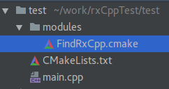

#RxCpp -> The first simple example

## Intro
I've been away from C++ for a while now, but it's always important to come back to your roots.  All that being said, there is always lots to learn from using different programming languages, libraries and environments.  I've been working in the Android world for sometime, keeping up with the latest trends and libraries supported on the platform.

When you start a new project there is always those libraries you add without even thinking and now RxJava/RxKotlin was an interesting addition to this scenario. Rx stands for reactive, and this is suppose to introduce the concept of reactive programming. I like to think of this as anything to do with taking in some input and throwing the output elsewhere. This is essentially what most programs consist of, whether it be listening on the network, taking inputs from an user or periodically completing a task.

I want to leave any more explanation of Rx to other blog posts and tutorials as there are many out there due to the support across many languages. I'd rather focus a little more on the usage in C++ by the accompanying library RxCpp which can be found here on [github](https://github.com/Reactive-Extensions/RxCpp).

## Project setup
 I'll be setting this project up using cmake as I believe this is the quickest way to get started. So first you'll need a empty folder and within this, a folder called modules. The empty folder will hold a CMakeLists.txt and a main.cpp file so go ahead and create them. You should have the following layout.

Now we need to populate the CMakeList.txt to pull in the RxCpp resources and compile main.cpp. I'm not going to go into this file as this is not a tutorial for cmake.

    cmake_minimum_required(VERSION 3.5)
    project(rxcpp_test)

    if(NOT DEFINED RXCPP_SOURCE_DIR)
        message(FATAL_ERROR "Please define RXCPP_SOURCE_DIR on the command line. -DRXCPP_SOURCE_DIR=pathToRxCppSource" )
    endif()

    list(APPEND CMAKE_MODULE_PATH "${CMAKE_CURRENT_SOURCE_DIR}/modules")

    find_package(RxCpp REQUIRED)
    message(STATUS "RXCPP_INCLUDE_DIR: " ${RXCPP_INCLUDE_DIR} )

    set(CMAKE_CXX_STANDARD 11)

    set(SOURCE_FILES main.cpp)

    include_directories(${RXCPP_INCLUDE_DIRS})
    add_executable(main ${SOURCE_FILES})
Inside the modules folder we now need to create a file called FindRxCpp.cmake. This will allow us to find the header files for the RxCpp library we want to include. Here is what the contents will look like.

    # Finds the C++ (RXCPP) Library
    #
    #  RXCPP_INCLUDE_DIRS   - Directory to include to get RXCPP headers

    SET(_RXCPP_REQUIRED_VARS  RXCPP_INCLUDE_DIR RXCPP_INCLUDE_DIRS )

    #
    ### FIRST STEP: Find the headers.
    #
    FIND_PATH(
            RXCPP_INCLUDE_DIR rxcpp/rx.hpp
            PATH "${RXCPP_SOURCE_DIR}"
            DOC "rxcpp include directory")
    MARK_AS_ADVANCED(RXCPP_INCLUDE_DIR)

    SET(RXCPP_INCLUDE_DIRS
            ${RXCPP_INCLUDE_DIR}/Rx/CPP/src
            ${RXCPP_INCLUDE_DIR}/Ix/CPP/src
            ${RXCPP_INCLUDE_DIR})

Now to write the main.cpp. This is going to be really simple so lets go through it.

    #include <iostream>

    #include "rxcpp/rx.hpp"

    int main() {
        auto observable = rxcpp::observable<>::create<const int>(
                {
                    subscriber.on_next(1);
                    subscriber.on_next(2);
                    subscriber.on_next(3);
                    subscriber.on_completed();
                });

        observable.subscribe(
                { std::cout << "Received integer : " << receivedData << std::endl;},
                { std::cout << "OnCompleted" << std::endl; }
        );
    }
One of the first things that will hit you will be the heavy use of lambdas. Lambdas are really useful when working with Rx as we are firing small segments of code from many different places and "reacting" to different situations.

On the first line you'll see the observable being created with a template parameter of const int. This is telling the Observable we are going to be firing ints to the observer.  A lambda is passed to the create method which fires the on_next events along with any on_error and on_complete which may occur.  This is where you can create your own custom streams of data.

After that you will see the subscriber (observer) which holds two lambdas. The first of which is the code sequence to run when on_next is called and the second is the same for on_complete. I have omitted the on_error in this example as we explicitly know that it will not be fired, but it is always good practice to handle.

## Clone RxCpp library
In any location you wish pull down the RxCpp library from github for later use.

    git clone --recursive https://github.com/Reactive-Extensions/RxCpp.git
    cd RxCpp

## Compile
First we need to run cmake.

    mkdir build
    cd build
    cmake -DCMAKE_BUILD_TYPE=Debug -DRXCPP_SOURCE_DIR=pathToRxCppRepo ..
RXCPP_SOURCE_DIR is the folder in which you cloned the rxcpp into.

## Run
Now, with the build directory you can run main and you should see the following.

    ./main
    Received integer : 1
    Received integer : 2
    Received integer : 3
    OnCompleted

## Summary
And that's it. There's not too much to discuss yet as we have pretty much just got the project setup. You can see how an observable is subscribed to and the data flows to the given code to execute. Pretty simple, it doesn't show much yet but the semantics. So next is the exploration of whats possible.
